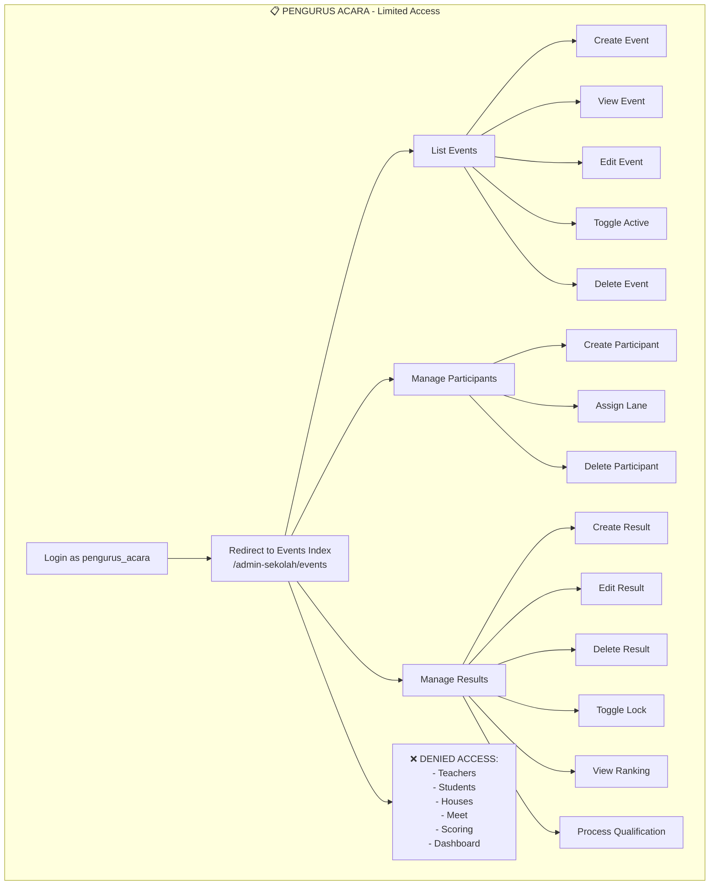
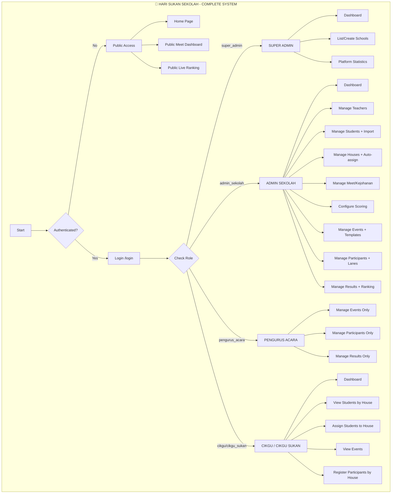
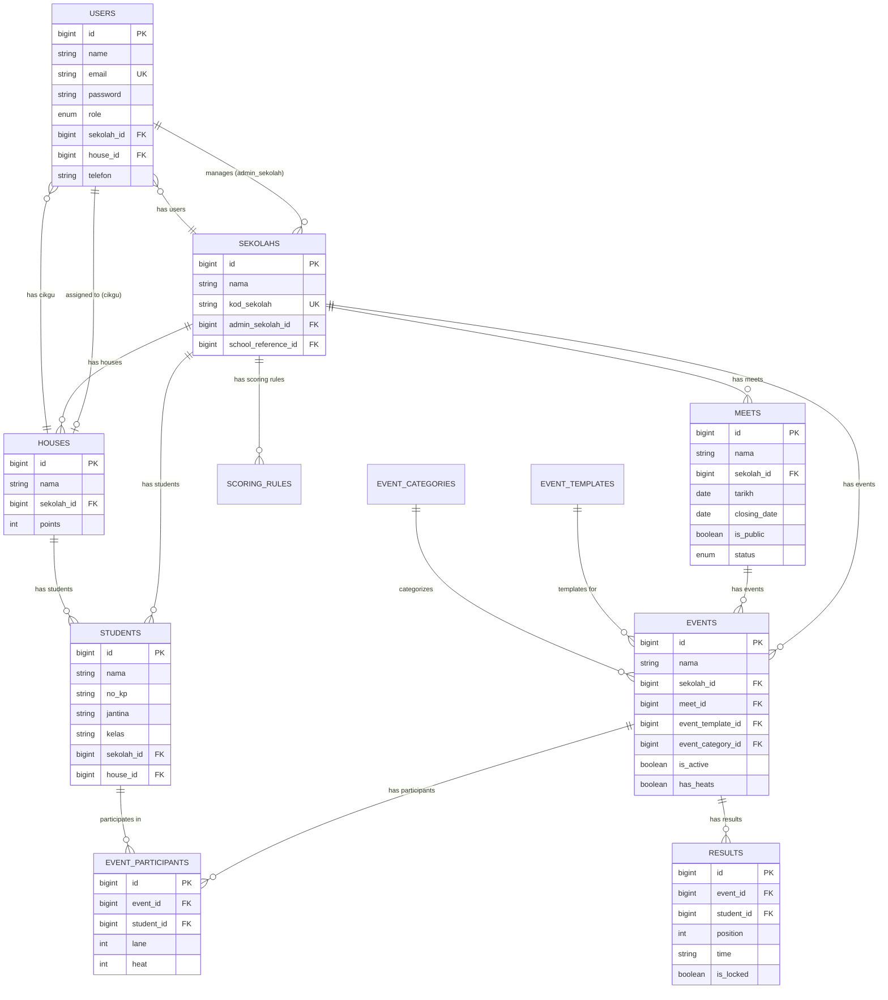

# Flowchart Sistem Hari Sukan Sekolah

## Authentication & Role-Based Access

```mermaid
graph TB
    subgraph AUTH["🔐 AUTHENTICATION"]
        START[Start] --> HOME[Home Page /]
        HOME --> LOGIN[Login /login]
        HOME --> REGISTER[Register Sekolah /register]
        
        REGISTER --> REG_FORM[Form: Nama, School Ref ID, Telefon]
        REG_FORM --> VALIDATE_REF{School Reference Valid?}
        VALIDATE_REF -->|No| REG_ERROR[Error: Reference tidak sah/sudah digunakan]
        VALIDATE_REF -->|Yes| CREATE_SEK[Create Sekolah Record]
        CREATE_SEK --> GEN_CODE[Generate kod_sekolah: SK-YYYYMMDD-XXXX]
        GEN_CODE --> GEN_ADMIN[Auto-generate Admin Sekolah]
        GEN_ADMIN --> SET_CRED[Email: skNNNN@sukansekolah.com<br/>Password: 123456]
        SET_CRED --> MARK_USED[Mark school_reference is_used = true]
        MARK_USED --> REG_SUCCESS[Success: Sekolah registered]
        
        LOGIN --> LOGIN_FORM[Form: Email + Password]
        LOGIN_FORM --> AUTH_CHECK{Credentials Valid?}
        AUTH_CHECK -->|No| LOGIN_ERR[Error: Invalid credentials]
        AUTH_CHECK -->|Yes| GET_ROLE[Get User Role]
    end
    
    subgraph ROLE_ROUTING["🔄 ROLE-BASED REDIRECT"]
        GET_ROLE --> CHECK_SUPER{Role = super_admin?}
        CHECK_SUPER -->|Yes| SUPER_DASH[Super Admin Dashboard<br/>/super-admin/dashboard]
        CHECK_SUPER -->|No| CHECK_ADMIN{Role = admin_sekolah?}
        CHECK_ADMIN -->|Yes| ADMIN_DASH[Admin Sekolah Dashboard<br/>/admin-sekolah/dashboard]
        CHECK_ADMIN -->|No| CHECK_PENGURUS{Role = pengurus_acara?}
        CHECK_PENGURUS -->|Yes| PENGURUS_EVENTS[Events Index<br/>/admin-sekolah/events]
        CHECK_PENGURUS -->|No| CHECK_CIKGU{Role = cikgu/cikgu_sukan?}
        CHECK_CIKGU -->|Yes| CIKGU_DASH[Cikgu Dashboard<br/>/cikgu/dashboard]
    end
```



## Super Admin Flow

```mermaid
graph TB
    subgraph SUPER_ADMIN["👑 SUPER ADMIN"]
        SUPER_DASH[Super Admin Dashboard]
        SUPER_DASH --> STATS[View Stats:<br/>- Total Schools<br/>- Total Admin Sekolah<br/>- Total Cikgu]
        SUPER_DASH --> LIST_SEK[List Schools /super-admin/sekolahs]
        LIST_SEK --> VIEW_SEK[View School Details<br/>/super-admin/sekolahs/{id}]
        VIEW_SEK --> SHOW_ADMIN[Show Admin Info]
        VIEW_SEK --> SHOW_CIKGUS[Show Cikgus List]
        
        SUPER_DASH --> CREATE_SEK_FLOW[Create School /super-admin/sekolahs/create]
        CREATE_SEK_FLOW --> FILL_FORM[Fill School Form]
        FILL_FORM --> SUBMIT_SEK[POST /super-admin/sekolahs]
        SUBMIT_SEK --> AUTO_ADMIN[Auto-create Admin Sekolah Account]
        AUTO_ADMIN --> SCHOOL_CREATED[School Created Successfully]
    end
```

## Admin Sekolah Flow (Complete)

```mermaid
graph TB
    subgraph ADMIN_SEKOLAH["🏫 ADMIN SEKOLAH - Full Access"]
        ADMIN_DASH[Admin Sekolah Dashboard]
        
        ADMIN_DASH --> DASH_STATS[View Stats:<br/>- Total Students<br/>- Total Teachers<br/>- Houses Ranking]
        
        subgraph TEACHERS["👨‍🏫 TEACHERS MANAGEMENT"]
            ADMIN_DASH --> TEACHER_LIST[List Teachers /admin-sekolah/teachers]
            TEACHER_LIST --> TEACHER_CREATE[Create Teacher POST /admin-sekolah/teachers]
            TEACHER_LIST --> TEACHER_DELETE[Delete Teacher DELETE /admin-sekolah/teachers/{id}]
            
            ADMIN_DASH --> ASSIGN_HOUSE[Teacher House Assignment /admin-sekolah/teachers/assignments]
            ASSIGN_HOUSE --> UPDATE_ASSIGN[Update Assignment PATCH /admin-sekolah/teachers/{id}/assignment]
        end
        
        subgraph STUDENTS["👨‍🎓 STUDENTS MANAGEMENT"]
            ADMIN_DASH --> STUDENT_LIST[List Students /admin-sekolah/students]
            STUDENT_LIST --> STUDENT_CREATE[Create Student POST /admin-sekolah/students]
            STUDENT_LIST --> STUDENT_SHOW[View Student /admin-sekolah/students/{id}]
            STUDENT_LIST --> STUDENT_DELETE[Delete Student DELETE /admin-sekolah/students/{id}]
            
            ADMIN_DASH --> IMPORT_STUDENT[Import Students /admin-sekolah/students/import]
            IMPORT_STUDENT --> DOWNLOAD_TEMPLATE[Download Template GET /admin-sekolah/students/import/template]
            IMPORT_STUDENT --> UPLOAD_FILE[Upload CSV/XLSX POST /admin-sekolah/students/import]
            UPLOAD_FILE --> IMPORT_RESULT[Show Import Result with Errors]
        end
        
        subgraph HOUSES["🏠 HOUSES MANAGEMENT"]
            ADMIN_DASH --> HOUSE_LIST[List Houses /admin-sekolah/houses]
            HOUSE_LIST --> HOUSE_CREATE[Create House POST /admin-sekolah/houses]
            HOUSE_LIST --> HOUSE_SHOW[View House /admin-sekolah/houses/{id}]
            HOUSE_LIST --> HOUSE_DELETE[Delete House DELETE /admin-sekolah/houses/{id}]
            
            ADMIN_DASH --> AUTO_ASSIGN[AUTO-ASSIGN STUDENTS POST /admin-sekolah/houses/auto-assign]
            AUTO_ASSIGN --> BALANCE_ASSIGN[Balanced Random Assignment to Houses]
        end
        
        subgraph MEET["🏆 MEET / KEJOHANAN MANAGEMENT"]
            ADMIN_DASH --> MEET_LIST[List Meets /admin-sekolah/meets]
            MEET_LIST --> MEET_SHOW[View Meet /admin-sekolah/meets/show]
            MEET_LIST --> MEET_EDIT[Edit Meet PATCH /admin-sekolah/meets]
            
            ADMIN_DASH --> LAUNCH_MEET[Launch Meet GET/POST /admin-sekolah/launch]
            LAUNCH_MEET --> MEET_ACTIVE[Meet Status = Active]
            
            ADMIN_DASH --> ACTIVATE_MEET[Activate Meet POST /admin-sekolah/meets/activate]
            ADMIN_DASH --> COMPLETE_MEET[Complete Meet POST /admin-sekolah/meets/complete]
            ADMIN_DASH --> TOGGLE_PUBLIC[Toggle Public POST /admin-sekolah/meets/toggle-public]
            ADMIN_DASH --> UPDATE_DATES[Update Dates PATCH /admin-sekolah/meets/dates]
        end
        
        subgraph SCORING["📊 SCORING CONFIGURATION"]
            ADMIN_DASH --> SCORING_VIEW[View Scoring /admin-sekolah/scoring]
            SCORING_VIEW --> SCORING_UPDATE[Update Scoring Rules PATCH /admin-sekolah/scoring/{category}]
        end
        
        subgraph EVENTS["🎯 EVENTS MANAGEMENT"]
            ADMIN_DASH --> EVENT_LIST[List Events /admin-sekolah/events]
            EVENT_LIST --> EVENT_CREATE[Create Event POST /admin-sekolah/events]
            EVENT_LIST --> EVENT_SHOW[View Event /admin-sekolah/events/{id}]
            EVENT_LIST --> EVENT_EDIT[Edit Event PATCH /admin-sekolah/events/{id}]
            EVENT_LIST --> EVENT_TOGGLE[Toggle Active POST /admin-sekolah/events/{id}/toggle]
            EVENT_LIST --> EVENT_DELETE[Delete Event DELETE /admin-sekolah/events/{id}]
            
            ADMIN_DASH --> EVENT_TEMPLATES[Select Templates /admin-sekolah/events/templates]
            EVENT_TEMPLATES --> CONFIG_TEMPLATES[Configure Templates]
            CONFIG_TEMPLATES --> STORE_FROM_TEMPLATE[Store from Templates POST /admin-sekolah/events/from-templates]
            
            EVENT_LIST --> PARTICIPANT_LIST[List Participants /admin-sekolah/events/{id}/participants]
            PARTICIPANT_LIST --> PARTICIPANT_CREATE[Create Participant POST /admin-sekolah/events/{id}/participants]
            PARTICIPANT_LIST --> ASSIGN_LANE[Assign Lane POST /admin-sekolah/events/{id}/participants/{pid}/lane]
            PARTICIPANT_LIST --> PARTICIPANT_DELETE[Delete Participant DELETE /admin-sekolah/events/{id}/participants/{pid}]
        end
        
        subgraph RESULTS["📋 RESULTS MANAGEMENT"]
            ADMIN_DASH --> RESULT_LIST[List Results /admin-sekolah/results]
            RESULT_LIST --> RESULT_CREATE[Create Result POST /admin-sekolah/results]
            RESULT_LIST --> RESULT_EDIT[Edit Result PATCH /admin-sekolah/results/{id}]
            RESULT_LIST --> RESULT_DELETE[Delete Result DELETE /admin-sekolah/results/{id}]
            RESULT_LIST --> TOGGLE_LOCK[Toggle Lock POST /admin-sekolah/results/{id}/toggle-lock]
            RESULT_LIST --> VIEW_RANKING[View Ranking /admin-sekolah/results/ranking]
            RESULT_LIST --> PROCESS_QUAL[Process Qualification POST /admin-sekolah/results/{id}/qualify]
        end
    end
```

## Pengurus Acara Flow (Limited Access)



## Cikgu / Cikgu Sukan Flow

```mermaid
graph TB
    subgraph CIKGU["👨‍🏫 CIKGU / CIKGU SUKAN"]
        CIKGU_START[Login as cikgu/cikgu_sukan]
        CIKGU_START --> CIKGU_DASH[Cikgu Dashboard /cikgu/dashboard]
        
        CIKGU_DASH --> CIKGU_STATS[View Stats:<br/>- Students in House<br/>- Events Overview]
        CIKGU_DASH --> CIKGU_HOUSE_RANK[View Houses Ranking]
        
        CIKGU_DASH --> CIKGU_STUDENTS[View Students /cikgu/students]
        CIKGU_STUDENTS --> FILTER_HOUSE[Filtered by Assigned House]
        
        CIKGU_DASH --> CIKGU_ASSIGN[Assign Students /cikgu/students/create]
        CIKGU_ASSIGN --> VIEW_UNASSIGNED[View Unassigned Students]
        CIKGU_ASSIGN --> POST_ASSIGN[POST /cikgu/students]
        
        CIKGU_DASH --> CIKGU_EVENTS[View Events /cikgu/events]
        CIKGU_EVENTS --> SHOW_ACTIVE[Show Active Events with Participant Counts]
        
        CIKGU_EVENTS --> CIKGU_PARTICIPANTS[View Participants /cikgu/events/{id}/participants]
        CIKGU_PARTICIPANTS --> FILTER_HOUSE_PART[Filtered by House Only]
        
        CIKGU_EVENTS --> CIKGU_REGISTER[Register Participants POST /cikgu/events/{id}/participants]
        CIKGU_REGISTER --> VALIDATE_REG{Validation Checks}
        VALIDATE_REG --> CHECK_SCHOOL[Student same school?]
        CHECK_SCHOOL --> CHECK_HOUSE[Student has house?]
        CHECK_HOUSE --> CHECK_MY_HOUSE[Student in my house?]
        CHECK_MY_HOUSE --> CHECK_ELIGIBLE[Eligible for event category/gender?]
        CHECK_ELIGIBLE --> CHECK_NOT_REG[Not already registered?]
        CHECK_NOT_REG --> CHECK_DATE[Before closing date?]
        CHECK_DATE --> CHECK_LIMIT[Under max participants limit?]
        CHECK_LIMIT --> REG_SUCCESS[Registration Successful]
        
        CIKGU_DASH --> CIKGU_DENIED[❌ CANNOT ACCESS:<br/>- Manage Houses<br/>- Manage Teachers<br/>- Manage Meet<br/>- Manage Scoring<br/>- Manage Results<br/>- Delete Students]
    end
```

## Public Access Flow

```mermaid
graph TB
    subgraph PUBLIC["🌐 PUBLIC ACCESS (No Login Required)"]
        PUBLIC_START[Visit Public URL]
        PUBLIC_START --> PUBLIC_HOME[Home Page /]
        
        PUBLIC_HOME --> PUBLIC_MEET[Public Meet Dashboard<br/>/public/sekolah/{kod_sekolah}]
        PUBLIC_MEET --> CHECK_PUBLIC{Meet is_public = true<br/>OR status = active?}
        CHECK_PUBLIC -->|No| PUBLIC_404[404 Not Found]
        CHECK_PUBLIC -->|Yes| SHOW_EVENTS[Show Events & Results]
        
        PUBLIC_HOME --> PUBLIC_RANKING[Live Ranking<br/>/public/sekolah/{kod_sekolah}/ranking]
        PUBLIC_RANKING --> CHECK_PUBLIC_RANK{Meet is_public = true<br/>OR status = active?}
        CHECK_PUBLIC_RANK -->|No| PUBLIC_404_RANK[404 Not Found]
        CHECK_PUBLIC_RANK -->|Yes| SHOW_RANKING[Show Live House Ranking]
    end
```

## Complete System Overview



## Database Entity Relationships



## Feature Access Matrix

| Feature | Super Admin | Admin Sekolah | Pengurus Acara | Cikgu | Public |
|---------|-------------|---------------|----------------|-------|--------|
| Dashboard | ✅ Full Stats | ✅ Full Stats | ❌ (Redirect to Events) | ✅ House Stats | ❌ |
| Manage Schools | ✅ CRUD | ❌ | ❌ | ❌ | ❌ |
| Manage Teachers | ❌ | ✅ CRUD + Assign | ❌ | ❌ | ❌ |
| Manage Students | ❌ | ✅ CRUD + Import | ❌ | ✅ View + Assign (by house) | ❌ |
| Manage Houses | ❌ | ✅ CRUD + Auto-assign | ❌ | ❌ | ❌ |
| Manage Meet | ❌ | ✅ Launch/Activate/Complete | ❌ | ❌ | ✅ View (if public) |
| Configure Scoring | ❌ | ✅ Update Rules | ❌ | ❌ | ❌ |
| Manage Events | ❌ | ✅ Full CRUD + Templates | ✅ Full CRUD | ✅ View Only | ✅ View (if public) |
| Manage Participants | ❌ | ✅ Full CRUD + Lanes | ✅ Full CRUD + Lanes | ✅ Register (by house) | ❌ |
| Manage Results | ❌ | ✅ Full CRUD + Lock + Ranking | ✅ Full CRUD + Lock + Ranking | ❌ | ✅ View (if public) |
| Live Ranking | ❌ | ✅ | ✅ | ✅ | ✅ View (if public) |

## Key System Rules

1. **Single Login Point**: Semua role login melalui `/login` yang sama
2. **Role-Based Redirect**: Selepas login, redirect automatik ikut role
3. **School Isolation**: Setiap admin_sekolah hanya boleh akses data sekolah sendiri
4. **House Isolation**: Cikgu hanya boleh lihat/urus pelajar dari house sendiri
5. **Pengurus Acara Limitation**: Akses terhad kepada Events & Results sahaja
6. **Cikgu Sukan = Cikgu**: Kedua-dua role treated sama oleh middleware
7. **Meet Singleton**: Satu sekolah = satu meet (kejohanan)
8. **Public Access Control**: Public routes hanya berfungsi jika `is_public=true` ATAU `status=active`
9. **Registration Deadline**: Pendaftaran peserta ditutup selepas `closing_date`
10. **School Reference System**: Setiap school reference boleh digunakan sekali sahaja
